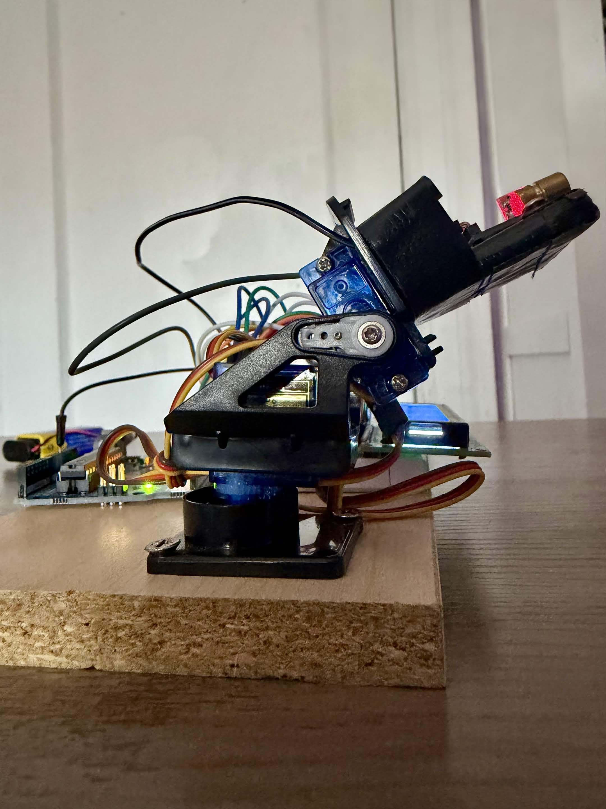
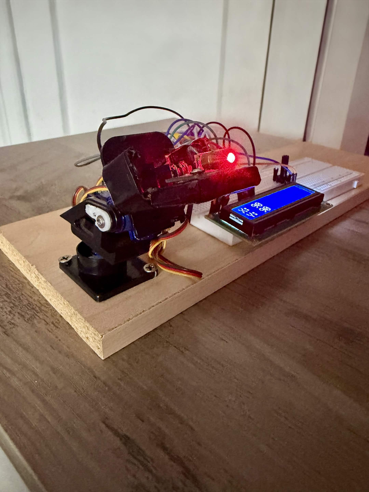
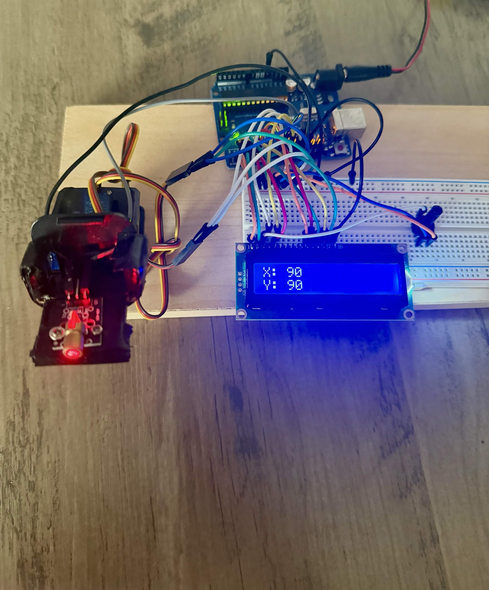
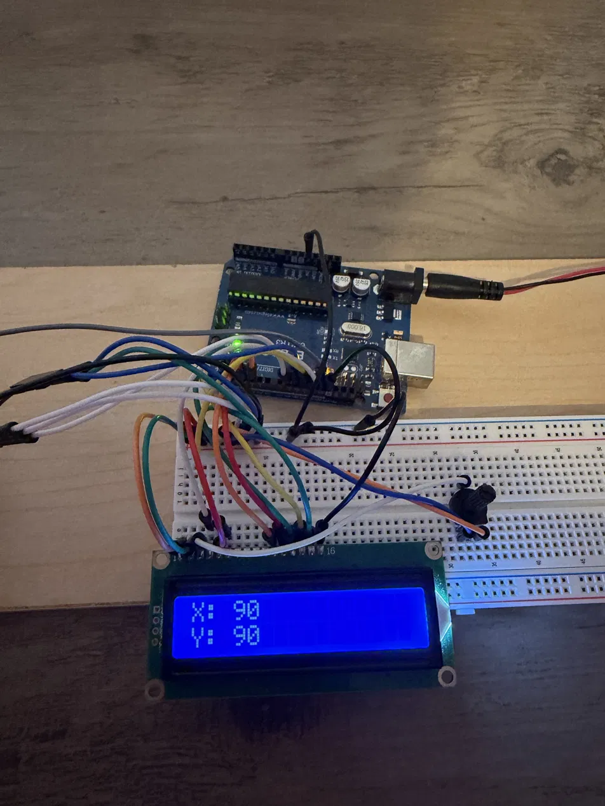
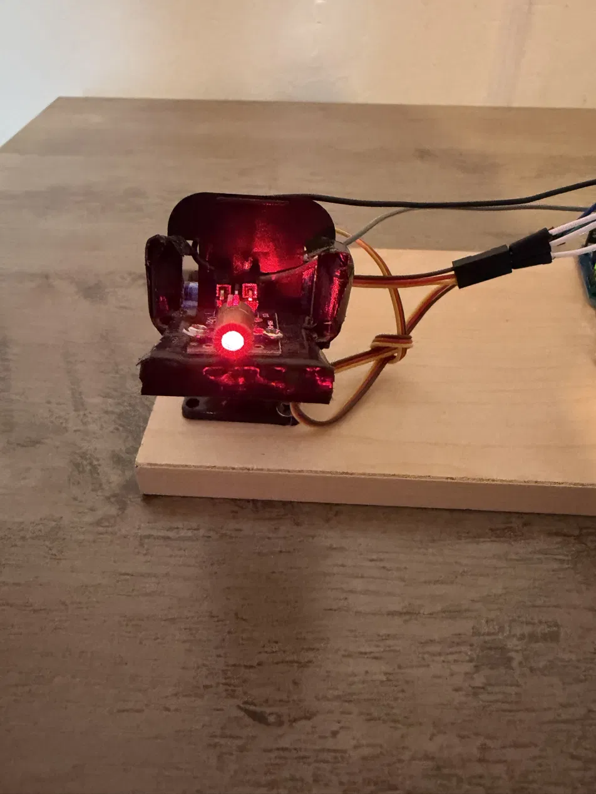

# Arduino Head Tracker

I built a webcam-based head tracker that controls a pan/tilt mechanism using an Arduino and two servos. An LCD displays the servo angles.

## My Work

I assembled a purchased pan/tilt mount, attached the laser module, and wired the electronics. I connected the tracking software to the Arduino and tested the system.

During testing, I adjusted the servo direction, movement range, and tilt calibration to match the mount. Both pan and tilt now work.

## How It Works

OpenTrack tracks head movement through a webcam. A Python script passes angle commands to the Arduino, which controls the servos. The code uses smoothing and a deadzone to reduce small, shaky movements.

## Main Components

- Arduino UNO R3
- Two servos and a pan/tilt mount
- Laser module
- LCD display
- Webcam

## What I Learned

This project helped me understand how breadboards work and how to wire components together, including their power, ground, and signal connections. Putting the circuit together gave me hands-on experience beyond just following a wiring diagram.

I also learned how different programs work together to control hardware. Connecting OpenTrack, the Python script, and the Arduino helped me understand how data moves from one program to another and eventually becomes physical movement.

Testing the system taught me how to troubleshoot problems step by step. I had to check the wiring, software connection, and servo settings to figure out why something wasn't moving as expected. Adjusting the direction and calibration showed me how changes in the code affect the actual mechanism.

## Build

*Assembled pan/tilt mount with laser diode and servo motor*

*Full system setup — laser mount, breadboard, and LCD display*

*Pan/tilt mount connected to the Arduino, with the LCD showing live X/Y output*

*Arduino Uno wired to the servo, laser module, and LCD display on a breadboard*

*Laser diode and pan/tilt housing, powered on*
